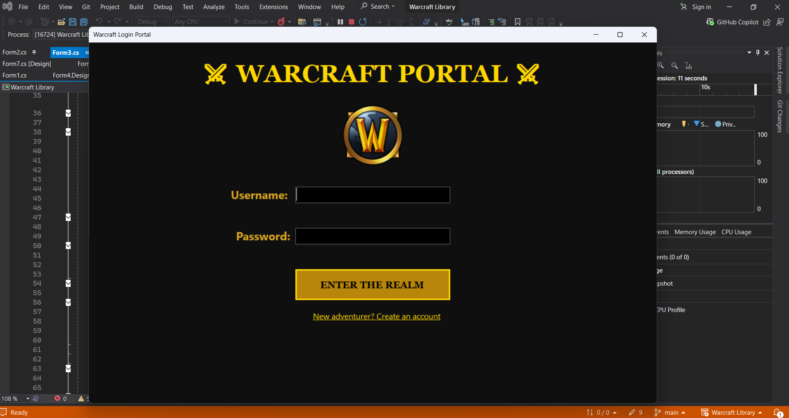

# Warcraft Library

This pproject is all about warcraft heroes and items and for warcraft fans like me with a little mini card game against a bot. This involves operations like CRUD for adding, updating, viewing, and deleting data, authentication and many more.

## Tools used for developing the project

## User Interfaces

